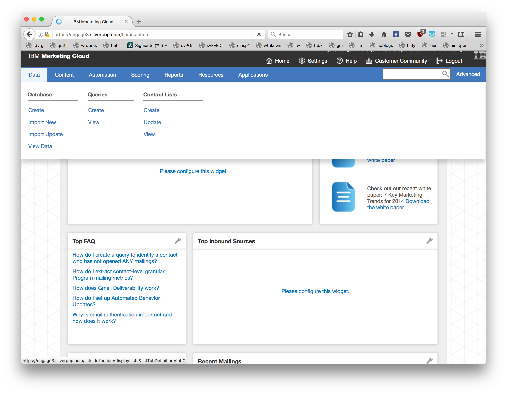

Ingresar en la pestaña data, luego hacer clic en database->create

Seleccionamos la opción single opt in ingresamos el nombre de la base de datos teniendo en cuenta la convención de los nombres.

El siguiente campo del formulario es la selección de la ruta donde se va a subir al bd,  sugerimos crear carpetas dentro de la carpeta qdata

luego seleccionamos restricted database, y luego Next.

la configuración final quedará así:

En la siguiente pantalla deben ingresar uno a uno los campos dinámicos de acuerdo a la plantilla que se vaya a enviar, por ejemplo si la plantilla usa el campo nombre debemos crear un field llamado NOMBRE  de tipo text, y luego hacer clic en create.

En la siguiente pantalla hacer clic en back to view data.

En la siguiente pantalla  seleccionar la pestaña Databases, seleccionar la base de datos recién creada, y hacer click en  import -> update existing.

En la siguiente pantalla (Select File) seleccionamos el csv a subir. escogemos la opción Comma-Separated Values (CSV),  y hacemos clic en next. 

en la siguiente pantalla (Define Format) hacer clic en next, 

en la siguiente pantalla(Map fields) mapear los campos del archivo versus los campos de la base de datos. y hacer clic en next, en la siguiente pantalla confirmar.

